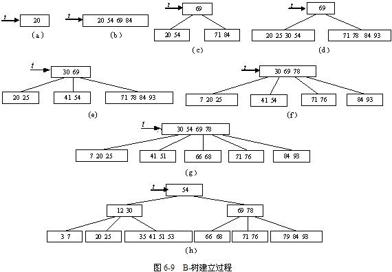

# B-树定义
B-树上每个节点包含多个关键码从小到大排序，是一种平衡的多路查找树。

一颗**m阶**的B-树的特性如下：

1. 树中每个结点最多含有m颗子树（**m>=2**）；

2. 除根结点和叶子结点外，其它每个结点至少有 **ceil(m / 2)** 颗子树；

3. 若根结点不是叶子结点，则至少有2颗子树；

4. 所有叶子结点都出现在同一层，叶子结点不包含任何关键字信息；

5. 每个非终端结点中包含有n个关键字信息： (n，P0，K1，P1，K2，P2，......，Kn，Pn)。其中：
- Ki (i=1...n)为关键字，且关键字按顺序升序排序K(i-1)< Ki。 
- Pi为指向子树根的接点，且指针P(i-1)指向子树种所有结点的关键字均小于Ki，但都大于K(i-1)。 
- 关键字的个数n必须满足： ceil(m / 2) - 1 <= n <= m-1。

# 建立m阶B-树

对关键码序列｛20，54，69，84，71，30，78，25，93，41，7，76，51，66，68，53，3，79，35，12｝，建立**5阶**B-树的过程如图6-9所示。
1. 向空树中插入20，得图6-9（a）。

2. 插入54，69，84，得图6-9（b）。

3. 插入71，索引项达到5，要分裂成三部分：{20，54}，{69}和{71，84}，并将69上升到该结点的父结点中，得图6-9（c）。

4. 插入30，78，25，93，得图6-9（d）。

5. 插入41，又分裂得图6-9（e）。

6. 7直接插入。

7. 76插入，分裂得图6-9（f）。

8. 51，66直接插入，当插入68，需分裂，得图6-9（g）。

9. 53，3，79，35直接插入，12插入时，需分裂，但中间关键码12插入父结点时，又需要分裂，则54上升为新根。15，65直接插入得图6-9（h）。
  

# B-树的插入
## 在B-树中插入关键码的思路
对高度为h的m阶B-树，新结点一般是插在第h层。通过检索可以确定关键码应插入的结点位置，分以下两种情况插入：
1. 若该结点中关键码个数小于m-1，则直接插入即可；

2. 若该结点中关键码个数等于m-1，则将引起结点的分裂。以中间关键码为界将结点一分为二，产生一个新结点，并把中间关键码插入到父结点（h-1层）中；重复上述工作，最坏的情况一直分裂到根结点，建立一个新的根结点，整个B-树增加一层。

对关键码序列｛C，N，G，A，H，E，K，Q，M，F，W，L，T，Z，D，P，R，X，Y，S｝，建立**5阶**B-树的过程:
1. 向空树中插入C，N，G，A，按升序排序；

2. 插入H时，含有A，C，G，N的结点空间不够，将分裂成2个结点，然后把中间关键码G上移到新的根结点中；指针区域为 < G、> G；

3. 插入E，K，Q时，直接插入；

4. 插入M时，含有H，K，N，Q的结点需要分裂，然后把中间关键码M上移到父节点中；指针区域为 < G、(G,M)、> M；

5. 插入F，W，L，T时，直接插入；

6. 插入Z时，含有N，Q，T，W的结点需要分裂，然后把中间关键码T上移到父节点中；指针区域为 < G、(G,M)、(M,T)、> T；

7. 插入D时，含有A，C，E，F的结点需要分裂，然后把中间关键码D上移到父节点中，再直接插入P，R，X，Y；指针区域为 < D、(D,G)、(G,M)、(M,T)、> T；

8. 插入S时，含有N，P，Q，R的结点需要分裂，然后把中间关键码Q上移到父节点中，这时父节点的空间已经满了，所以也要进行分裂，将父节点中的中间关键码M上移到新形成的根结点中。

