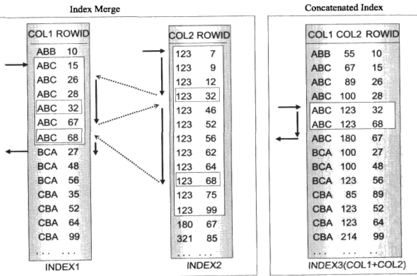

# 索引的概念
索引是一种特殊的文件(InnoDB数据表上的索引是表空间的一个组成部分)，它们包含着对数据表里所有记录的引用指针。更通俗的说，索引好比是一本书的目录，能加快查询速度。

注意：

- 创建索引和维护索引都要耗费时间，这种时间随着数据量的增加而增加

- 索引需要占用物理空间，除了数据表占数据空间之外，每一个索引还要占一定的物理空间

- 当对表中的数据进行增加、删除和修改的时候，索引也要动态的维护，这样就降低了数据的维护速度

- 索引并不是越多越好，总的来说，只要当索引帮助存储引擎快速找到记录带来的好处大于其带来的额外工作时，索引才是有用的

- 对于非常小的表，大部分情况下简单的全表扫描更高效，没有必要再建立索引；对于中到大型的表，索引带来的好处就非常明显了

# 索引的类型
- 常规索引

常规索引，也叫普通索引（index或key），它可以常规地提高查询效率。一张数据表中可以有多个常规索引。

```sql
ALTER TABLE 'table_name' ADD INDEX index_name('col');
```

- 主键索引

主键索引（Primary Key），也简称主键。它可以提高查询效率，并提供唯一性约束。一张表中只能有一个主键。

```sql
ALTER TABLE 'table_name' ADD PRIMARY KEY pk_index('col');
```

- 唯一索引

唯一索引（Unique Key），可以提高查询效率，并提供唯一性约束。一张表中可以有多个唯一索引。

```sql
ALTER TABLE 'table_name' ADD UNIQUE index_name('col');
```

**主键索引与唯一索引的唯一区别是：前者在定义时使用的关键字是PRIMARY而不是UNIQUE。**

- 全文索引

全文索引（Full Text），对文本的内容进行分词，可以提高全文搜索的查询效率，一般使用Sphinx。但Sphinx不支持中文检索，Coreseek是支持中文的全文检索引擎，也称作具有中文分词功能的Sphinx。

Sphinx是一个基于SQL的全文检索引擎，可以结合MySQL、PostgreSQL做全文搜索，它可以提供比数据库本身更专业的搜索功能，使得应用程序更容易实现专业化的全文检索。

全文索引可以使 **LIKE %word%** 走索引查询。


```sql
ALTER TABLE 'table_name' ADD FULLTEXT INDEX ft_index('col');
```

- 前缀索引

如果索引列很长，就会使得索引变得大且慢，这个时候，可以索引该字符列开始的部分字符，这样可以大幅节约索引空间，提高索引效率。但是需要注意的是，这样也可能会降低索引的选择性。

```sql
ALTER TABLE 'table_name' ADD INDEX index_name(col1(4),col2(3));
```

```
表示使用col1的前4个字符和col2的前3个字符作为索引
```

- 组合索引

把多个列值组合成一个索引。

```sql
ALTER TABLE 'table_name' ADD INDEX index_name('col1','col2','col3');
```

组合索引必须遵循"最左前缀原则"，把最常检索的列放在最左。

索引生效的情形有：(col1)，(col1,col2)，(col1,col3)，(col1,col2,col3)

索引失效的情形有：(col2)，(col3)，(col2,col3)

- 合并索引

使用多个单列索引作为查询条件，进行查询。

```sql
ALTER TABLE 'table_name' ADD INDEX index_name('col1');

ALTER TABLE 'table_name' ADD INDEX index_name('col2');

ALTER TABLE 'table_name' ADD INDEX index_name('col3');

SELECT * FROM table_name WHERE col1='col1' AND col2='col2' AND col3='col3';
```

组合索引与合并索引的区别



从上图中可以看出，组合索引综合保存了COL1和COL2的数据，它不需要在2个索引表之间跳转，所以速度会更快。

**尽量使用组合索引，而不是合并索引**

- 覆盖索引

查询的列被索引覆盖，即查询的时候，在索引上就直接获得了所需要的数据。

覆盖索引从辅助索引中就可以直接得到查询的记录，而不需要再次查询聚集索引中的记录。使用覆盖索引的一个好处就是辅助索引不包含整行记录，因此它的大小远小于聚集索引，可以减少大量IO操作，查询速度很快。

在EXPLAIN的Extra列可以看到Using Index信息。

- 聚簇索引（Cluster Index)

聚簇索引并不是一种单独的索引类型，而是一种数据存储方式。InnoDB的聚簇索引实际上在同一结构中保存了 B-Tree 索引和数据行。

当表中有聚簇索引时，它的数据行实际上存放在索引的叶子页（leaf page）中，也就是说，叶子页包含了行的全部数据，而节点页只包含了索引列的数据。

InnoDB 通过主键聚集数据，如果没有定义主键，InnoDB 会选择一个唯一的非空索引代替。如果没有这样的索引，InnoDB 会隐式定义一个主键来作为聚簇索引。

聚簇索引的优点

- 可以把相关的数据保存在一起

- 数据访问更快。聚簇索引将索引和数据保存在同一个B-Tree中，因此，从聚簇索引中获取数据通常比非聚簇索引要快

- 使用覆盖索引扫描的查询可以直接使用节点页中的主键值

- 如果在设计表和查询时，能充分利用上面的优点，就可以极大地提升性能

聚簇索引的缺点

- 聚簇索引最大限度地提高了I/O密集型应用的性能，但如果数据全部放在内存中，则访问的顺序就没那么重要了，聚簇索引也就没什么优势了

- 插入速度严重依赖于插入顺序。按照主键的顺序插入是插入数据到InnoDB表中速度最快的方式；但如果不是按照主键顺序插入数据，那么，在操作完毕后，最好使用 OPTIMIZE TABLE 命令重新组织一下表

- 更新聚簇索引列的代价很高，因为会强制InnoDB将每个被更新的行移动到新的位置

- 基于聚簇索引的表在插入新行，或者主键被更新，导致需要移动行的时候，可能面临“页分裂（page split）”的问题。页分裂会导致表占用更多的磁盘空间

在InnoDB中，聚簇索引就是"表"，所以不像MyISAM那样需要独立的行存储。聚簇索引的每一个叶子节点都包含了主键值、事务ID、用于事务和MVCC（多版本控制）的回滚指针以及所有的剩余列

InnoDB的二级索引（非聚簇索引）和聚簇索引差别很大，二级索引的叶子节点中存储的不是"行指针"，而是主键值。故通过二级索引查找数据时，会进行两次索引查找。存储引擎需要先查找二级索引的叶子节点来获得对应的主键值，然后根据这个主键值到聚簇索引中查找对应的数据行

- 非聚簇索引(Secondary Index)

InnoDB中所有除聚簇索引以外的所有索引都被称为辅助索引，即非聚簇索引。对于辅助索引，叶子节点并不包含行记录的全部数据。叶子节点除了包含键值以外，每个叶子节点的索引行中还包含一个主键值。通过主键值InnoDB存储引擎可以再次在聚集索引中找到对应索引项的行数据。辅助索引的存在不会影响数据在聚集索引中的组织，因此每张表上可以存在多个辅助索引。当通过辅助索引来查找数据时，InnoDB存储引擎会遍历辅助索引并获得页中的指向主键索引的主键，然后再通过主键索引依次找到一个完整的行记录。因此，这就意味着通过辅助索引查找行，存储引擎先找到辅助索引的叶子节点，得到对应的主键值，然后根据该主键值去聚集索引上查找对应的行数据。也即一次辅助索引查找需要两次对B+树进行查找。

# 索引的方法

- B-Tree索引

默认的索引方法，B-Tree 对索引列是顺序存储的，因此很适合查找范围数据。它能够加快访问数据的速度，因为存储引擎不再需要进行全表扫描来获取需要的数据。

- HASH索引

哈希索引用索引列的值计算该值的hashCode，然后在hashCode相应的位置存执该值所在行数据的物理位置，因为使用散列算法，因此访问速度非常快，但是一个值只能对应一个hashCode，而且是散列的分布方式，因此哈希索引不支持范围查找和排序的功能。

# 索引的使用策略
## 需要使用索引的情形

- 主键自动建立唯一索引

- 经常作为查询条件在WHERE或者ORDER BY 语句中出现的列要建立索引

- 作为排序的列要建立索引

- 查询中与其他表关联的字段，外键关系建立索引

- 高并发条件下倾向组合索引

- 用于聚合函数的列可以建立索引，例如使用了max(col1)或者count(col1)时的col1就需要建立索引

## 不需要使用索引的情形

- 经常增删改的列不要建立索引

- 有大量重复的列不要建立索引

- 表记录太少不要建立索引，只有当数据表里有了足够多的数据时，建立索引才有实际意义。

## 索引失效的情况

- 组合索引必须遵循最左前缀原则，否则，组合索引失效

- 在组合索引中不能有列的值为NULL，否则，组合索引失效

- 在一个查询语句中，索引只能使用一次，如果在WHERE中使用了，那么在ORDER BY中就不要用了

- LIKE '%word%' 查询不会使用索引，也就是索引会失效，但是 LIKE 'word%' 查询会使用索引

- 在索引的列上使用表达式或者函数会使索引失效而进行全表扫描

```sql
错误的用法：SELECT * FROM test WHERE id - 1 = 9; 

正确的用法：SELECT * FROM test WHERE id = 10; 
```

```sql
错误的用法：SELECT * FROM test WHERE SUBSTR(name, 1, 2) = 'x/'; -- name = 'x/y/z'

正确的用法：SELECT * FROM test WHERE name LIKE 'x/%'; 
```

- 在查询条件中使用 != 、 < 、 > 会导致索引失效。但是，如果对主键索引使用 != 、 < 、 > ，则索引不会失效

- 在查询条件中使用 IS NULL 或者 IS NOT NULL 会导致索引失效

- 在查询条件中使用 NOT IN 或者 NOT EXIST 会导致索引失效

- 隐式转换会导致索引失效，比如字段 age 是 int 类型

```sql
错误的用法：SELECT * FROM test WHERE age = '20'; 

正确的用法：SELECT * FROM test WHERE age = 20; 
```

- 在查询条件中使用 OR 会导致索引失效，除非 OR 连接的每个条件都加上索引，这时应该改为两次查询，然后用 UNION ALL 连接起来

- 如果排序的字段使用了索引，那么 SELECT 的字段也要是索引字段，否则索引失效。如果排序的是主键索引，则SELECT * 不会导致索引失效

- 尽量不要使用多列排序，如果一定要，就使用组合索引

- 如果mysql估计使用全表扫描要比使用索引快，则不使用索引

# EXPLAIN用法之Extra

[EXPLAIN Mysql官网](https://dev.mysql.com/doc/refman/5.7/en/explain-output.html "EXPLAIN Mysql官网")

Extra 列提供了有关不同种类的 MySQL 优化器路径的一系列额外信息。

|关键字|描述|
|--|--|
|Using index|查询的列被索引覆盖，并且where筛选条件是索引的前导列，Extra中为Using index|
|Using where Using index|1. 查询的列被索引覆盖，并且where筛选条件是索引列之一，但不是索引的前导列，Extra中为Using where Using index；意味着无法直接通过索引查找来查询到符合条件的数据。2.查询的列被索引覆盖，并且where筛选条件是索引列前导列的一个范围，同样意味着无法直接通过索引查找查询到符合条件的数据|
|NULL|查询的列未被索引覆盖，并且where筛选条件是索引的前导列，意味着用到了索引，但是部分字段未被索引覆盖，必须通过"回表"来实现，不是纯粹地用到了索引，也不是完全没用到索引，Extra中为NULL(没有信息)|
|Using where|1.查询的列未被索引覆盖，where筛选条件非索引的前导列，Extra中为Using where；2. 查询的列未被索引覆盖，where筛选条件非索引列，Extra中为Using where|
|Using index condition|1. 查询的列不全在索引中，where条件中是一个前导列的范围；2. 查询列不完全被索引覆盖，查询条件完全可以使用到索引（进行索引查找）|

# Explain extend调优

```sql
mysql> EXPLAIN EXTENDED SELECT `name` FROM test WHERE id IN (SELECT id FROM test WHERE id >= 10);
+----+-------------+-----------+------------+--------+---------------+---------+---------+------------------------+---------+----------+--------------------------+
| id | select_type | table     | partitions | type   | possible_keys | key     | key_len | ref                    | rows    | filtered | Extra                    |
+----+-------------+-----------+------------+--------+---------------+---------+---------+------------------------+---------+----------+--------------------------+
|  1 | SIMPLE      | test | NULL       | range  | PRIMARY,id    | id      | 4       | NULL                   | 1384484 |      100 | Using where; Using index |
|  1 | SIMPLE      | test | NULL       | eq_ref | PRIMARY,id    | PRIMARY | 4       | db.test.id |       1 |      100 | NULL                     |
+----+-------------+-----------+------------+--------+---------------+---------+---------+------------------------+---------+----------+--------------------------+
2 rows in set

mysql> SHOW WARNINGS;
+---------+------+-----------------------------------------------------------------------------------------------------------------------------------------------------------------------------------------------------------------------------------------+
| Level   | Code | Message                                                                                                                                                                                                                                 |
+---------+------+-----------------------------------------------------------------------------------------------------------------------------------------------------------------------------------------------------------------------------------------+
| Warning | 1681 | 'EXTENDED' is deprecated and will be removed in a future release.                                                                                                                                                                       |
| Note    | 1003 | /* select#1 */ select `db`.`test`.`name` AS `name` from `db`.`test` join `db`.`test` where ((`db`.`test`.`id` = `db`.`test`.`id`) and (`db`.`test`.`id` >= 10)) |
+---------+------+-----------------------------------------------------------------------------------------------------------------------------------------------------------------------------------------------------------------------------------------+
2 rows in set
```

在 Result2 的 Message 列中，可以看到 mysql 对 sql 优化的建议语句
