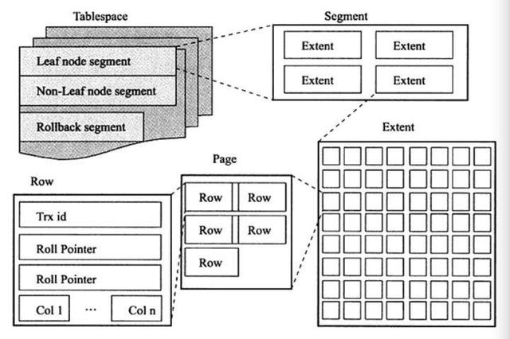

# 逻辑表结构
MySQL表中的所有数据被存储在一个空间内，称之为表空间，表空间内部又可以分为段(segment)、区(extent)、页(page)、行(row)，逻辑结构如下图：

- 段(segment)

表空间是由不同的段组成的，常见的段有：数据段，索引段，回滚段等等，在 MySQL中，数据是按照B+树来存储，因此数据即索引，因此数据段即为B+树的叶子节点，索引段为B+树的非叶子节点,回滚段用于存储undo日志，用于事务失败后数据回滚以及在事务未提交之前通过undo日志获取之前版本的数据。

- 区(extent)

区是由连续页组成的空间，每个区的固定大小为1MB,为保证区中页的连续性，InnoDB会一次从磁盘中申请4~5个区，在默认不压缩的情况下，一个区可以容纳64个连续的页。但是在开始新建表的时候，空表的默认大小为96KB,是由于为了高效的利用磁盘空间，在开始插入数据时表会先利用32个页大小的碎片页来存储数据，当这些碎片使用完后，表大小才会按照MB倍数来增加。

- 页(page)

页是InnoDB存储引擎的最小管理单位，每页大小默认是16KB。

- 行(row)

行对应的是表中的行记录，每页存储最多的行记录也是有硬性规定的最多16KB/2-200，即7992行（16KB是页大小，据说是内核定义）

# 文件类型

- .frm文件：保存了每个表的元数据，包括表结构的定义等，该文件与数据库引擎无关。

- .ibd文件：存放表的数据文件和索引文件。
