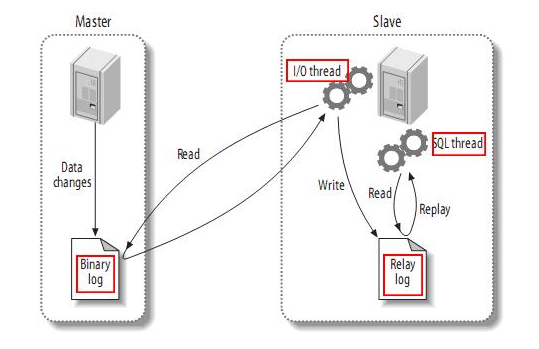

# mysql8 数据库主从同步配置
## mysql 主从同步的原理


## 主库
### 修改主服务器的配置文件 my.cnf
```bash
# vim /etc/my.cnf
[mysqld]
server-id=200 #取本机ip的末端即可

#binlog-ignore-db=db_name   #不同步的数据库,如果指定了binlog-do-db这里应该可以不用指定的
binlog-do-db=db_name #要同步的数据库

log-bin=mysql-bin #开启二进制日志，这一点决定了数据同步的成败，mysql-bin是自定义的二进制日志名称
```

### 在主库添加用户并授权
```bash
mysql> use mysql;

mysql> create user 'username'@'slave ip' identified by 'password';

mysql> grant replication slave on *.* to 'username'@'slave ip';

mysql> alter user 'username'@'%' identified with mysql_native_password BY 'password';

mysql> flush privileges; 

mysql> select * from user where user = 'username' \G
Repl_slave_priv: Y
```

### 删除用户及授权
```bash
mysql> revoke all on *.* from 'username'@'slave ip'; #删除授权

mysql> use mysql;

mysql> delete from user where user='username' and host='slave ip'; #删除用户

mysql> flush privileges; #刷新
```

### 记录主库 File 和 Position 项对应的值
```bash
mysql> show master status \G
File: mysql-bin.000002
Position: 156
```

## 从库

### 修改从服务器的配置文件 my.cnf
```bash
# vim /etc/my.cnf
[mysqld]
server-id=210

#replicate-wild-do-table=db_name.table_name
replicate-do-db=db_name

log-bin=mysql-bin
```

### 配置从库连接主库所需的信息
```bash
mysql> stop slave;

mysql> change master to master_host='master ip',master_port=3306,master_user='username',master_password='password',master_log_file='mysql-bin.000002',master_log_pos=156;
```
    master_log_file 对应主库 File 项值

    master_log_pos 对应主库 Position 项值

### 开启从库的同步功能
```bash
mysql> start slave;
```

### 查看从库状态
```bash
mysql> show slave status \G
Slave_IO_State: Waiting for master to send event
Master_Log_File: mysql-bin.000002 #主库 file 项对应的值
Read_Master_Log_Pos: 156 #主库 position 项对应的值
Slave_IO_Running: Yes  #连接到主库，并读取主库的日志到本地，生成本地日志文件
Slave_SQL_Running: Yes #读取本地日志文件，并执行日志里的 SQL 命令
```

### 在主库执行 CRUD 操作，从库会同步更新

**注意：**
- 主从库间的数据不是实时同步的。 

- 如果主从库之间的网络断开，则从库会在网络正常后批量同步。 

- 如果在从库修改数据，就很可能造成从库在执行主库的 bin-log 时出现错误而停止同步，一般不建议在从库进行 CRUD 操作。

## 同步参数说明
### 主库同步参数
- binlog-do-db: 二进制日志记录的数据库

- binlog-ignore-db: 二进制日志中忽略数据库

### 从库同步参数
- replicate-do-db: 配置需要同步的数据库，如果需要同步多个数据库，写法如下：

```bash
replicate-do-db=db_name1
replicate-do-db=db_name2
```

- replicate-ignore-db: 配置需要忽略的同步数据库

- replicate-do-table: 配置需要同步的表，如果需要同步多个表，写法如下：

```
replicate-do-table=db_name.table_name1
replicate-do-table=db_name.table_name2
```

- replicate-ignore-table: 配置需要忽略的同步表

- replicate-wild-do-table: 同步表的时候，**建议使用该项配置**。同 replication-do-table 功能一样，但是可以通配符，如 db_name.%

- replicate-wild-ignore-table: 同 replication-ignore-table 功能一样，但是可以加通配符

## 配置过程遇到的问题
**当且仅当 Slave_IO_State: Waiting for master to send event 的时候，才表示从库启动成功。**

### Last_IO_Error: error connecting to master 'root@master ip:3306' - retry-time: 60 retries: 1 message: Authentication plugin 'caching_sha2_password' reported error: Authentication requires secure connection.
- 错误原因
   密码加密方式不支持

- 解决方法，在主服务器执行以下命令：
   ```bash
   mysql> alter user 'username'@'%' identified with mysql_native_password BY 'password';
   
   mysql> flush privileges; 
   ```

### Last_IO_Error: Fatal error: The slave I/O thread stops because master and slave have equal MySQL server UUIDs; these UUIDs must be different for replication to work.
- 错误原因
   主从服务器的 mysql 使用了相同的 UUID

   - 解决方法
   ```bash
   # cd /var/lib/mysql
   # vim auto.cnf
   [auto]
   server-uuid=修改成唯一的uuid
   ```
