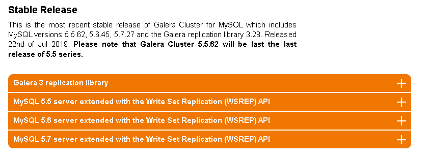

# 下载地址
官网： https://galeracluster.com/downloads/



必须下载的项：
- galera-3-25.3.28-1.el7.x86_64.rpm
- mysql-wsrep-5.7-5.7.27-25.19.el7.x86_64.rpm
- mysql-wsrep-client-5.7-5.7.27-25.19.el7.x86_64.rpm
- mysql-wsrep-common-5.7-5.7.27-25.19.el7.x86_64.rpm
- mysql-wsrep-libs-5.7-5.7.27-25.19.el7.x86_64.rpm
- mysql-wsrep-libs-compat-5.7-5.7.27-25.19.el7.x86_64.rpm
- mysql-wsrep-server-5.7-5.7.27-25.19.el7.x86_64.rpm

# 先卸载之前安装的mariadb或者mysql

# 安装依赖包socat、boost、rsync、lsof
```
# yum -y install socat boost rsync lsof
```

# 依次执行以下命令
```
# rpm -ivh mysql-wsrep-common-5.7-5.7.27-25.19.el7.x86_64.rpm

# rpm -ivh mysql-wsrep-libs-5.7-5.7.27-25.19.el7.x86_64.rpm

# rpm -ivh mysql-wsrep-libs-compat-5.7-5.7.27-25.19.el7.x86_64.rpm

# rpm -ivh mysql-wsrep-client-5.7-5.7.27-25.19.el7.x86_64.rpm

# rpm -ivh mysql-wsrep-server-5.7-5.7.27-25.19.el7.x86_64.rpm

# rpm -ivh mysql-wsrep-5.7-5.7.27-25.19.el7.x86_64.rpm

# rpm -ivh galera-3-25.3.28-1.el7.x86_64.rpm
```

# 安装
```
# rpm -ivh galera-3-25.3.28-1.el7.x86_64.rpm
warning: galera-3-25.3.28-1.el7.x86_64.rpm: Header V4 RSA/SHA512 Signature, key ID bc19ddba: NOKEY
Preparing...                         ################################# [100%])
	file /usr/bin/garbd from install of galera-3-25.3.28-1.el7.x86_64 conflicts with file from package galera-25.3.24-1.rhel7.el7.centos.x86_64
```

如果安装包有冲突，就先卸载冲突的安装包：
```
# yum -y remove galera-25.3.24-1.rhel7.el7.centos.x86_64
```

继续安装:
```
# rpm -ivh galera-3-25.3.28-1.el7.x86_64.rpm
```

